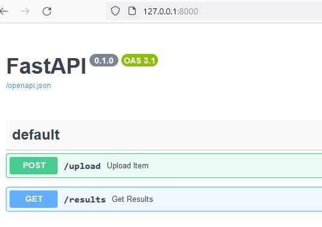
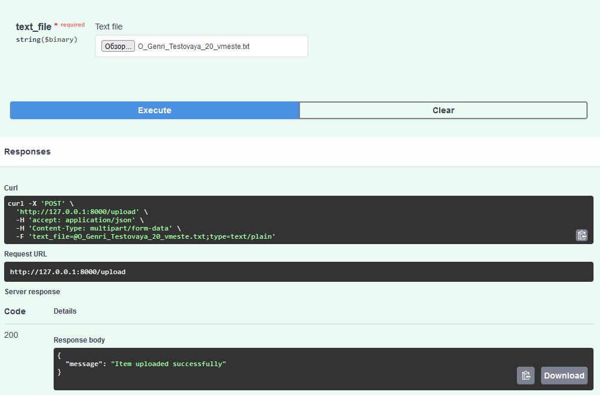
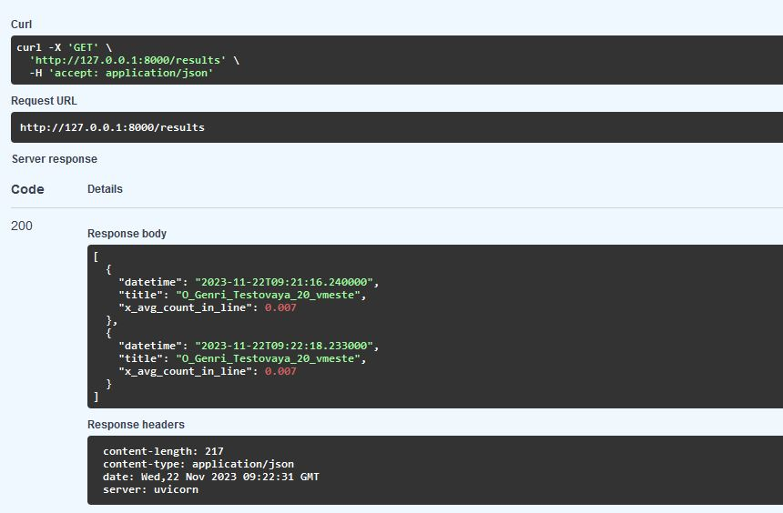

# Тестовое задание для Baum
Ассинхронное FastAPI приложение, принимающее текстовый файл. Отправляет его в брокер сообщений, который обрабатывает 
текст, делает задержку в 3с и сохраняет в бд.

Создается два эндпоинта:
1) /upload - для загрузки файла
2) /results - для получения данных из бд

 

### клонируем репозиторий 

    git clone https://github.com/se-andrey/baum.git

### запуск

Создайте файл .env и заполните его в соответствии с .env.example.

Если на сервере нет docker/docker-compose, то установите его - инструкция https://docs.docker.com/

Для запуска:

    docker-compose up --build 

Для остановки:

    docker-compose down -v

### примеры

